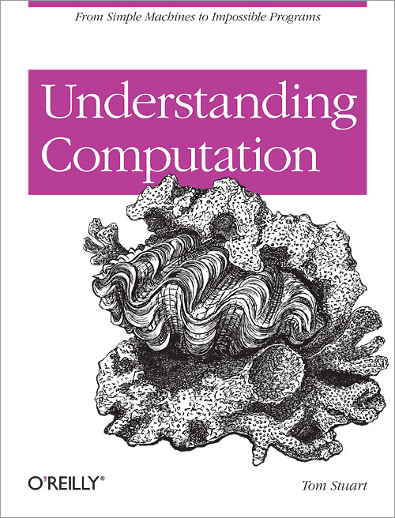

!SLIDE
# How telling changes the shape of your code

!SLIDE



!SLIDE
```ruby
  def run
    while expression.reducible?
      puts expression
      step
    end

    puts expression
  end

  def step
    self.expression = expression.reduce
  end
```

!SLIDE
```ruby
    def run
      expression.reduce
    end
```
